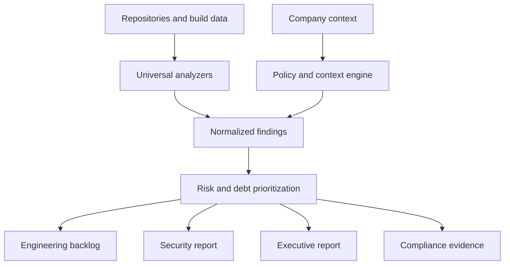
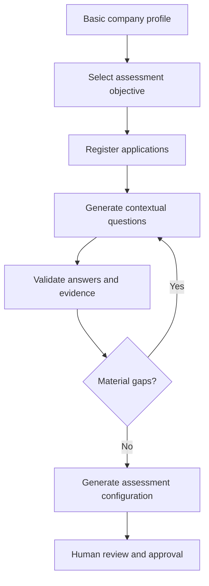

Yes—technical debt and source-code security vary significantly by company, but the underlying analysis engine does not need to be rebuilt for every customer.

The best product architecture is:

> A standardized analysis platform + a configurable company-specific policy and context layer.

### What remains universal

These capabilities apply broadly across companies:

| Core capability  | Examples                                                                |
| ---------------- | ----------------------------------------------------------------------- |
| Code quality     | Complexity, duplication, dead code, oversized functions                 |
| Architecture     | Cycles, coupling, layering violations, dependency concentration         |
| Security         | SAST, secret detection, vulnerable dependencies, insecure configuration |
| Testing          | Coverage gaps, flaky tests, untested critical paths                     |
| Maintainability  | Obsolete libraries, unsupported runtimes, code ownership gaps           |
| Reliability      | Missing error handling, retry problems, unsafe concurrency              |
| Operational debt | Poor logging, missing metrics, deployment risks                         |
| Documentation    | Undocumented APIs, stale documentation, missing decisions               |
| Prioritization   | Severity, business impact, remediation effort, exploitability           |
| Reporting        | Executive, engineering, security and compliance reports                 |

### What changes by company

| Configuration area       | Why it differs                                                       |
| ------------------------ | -------------------------------------------------------------------- |
| Languages and frameworks | Java banking system versus Python AI product                         |
| Architecture rules       | Microservices, modular monolith, blockchain or embedded software     |
| Business criticality     | Authentication code carries more risk than an internal dashboard     |
| Risk tolerance           | Startup velocity versus regulated enterprise controls                |
| Compliance               | SOC 2, PCI DSS, HIPAA, ISO 27001, FDA, NIST or internal standards    |
| Coding standards         | Naming, layering, approved libraries and testing requirements        |
| Threat model             | Public SaaS, on-premises product, financial system or smart contract |
| Existing tools           | SonarQube, Snyk, Semgrep, GitHub Advanced Security, Jira             |
| Debt definitions         | Some accept legacy code; others classify it as a release blocker     |
| Reporting expectations   | CTO summary, developer backlog, audit evidence or board reporting    |

### Recommended system model



The platform should separate five important concepts:

1. **Finding** — observable evidence, such as SQL injection or excessive complexity.
2. **Rule** — the condition that created the finding.
3. **Policy** — how that company treats the finding.
4. **Risk** — the contextual effect on the company.
5. **Remediation** — the proposed correction and verification method.

For example:

```text
Finding: Log4j version contains a known vulnerability
Evidence: pom.xml line 83
Universal severity: Critical
Company context: Internet-facing payment service
Policy: No critical vulnerabilities allowed in production
Decision: Block release
Remediation: Upgrade dependency and run regression/security tests
```

The same vulnerable dependency in an isolated experimental repository might produce a warning rather than a release block. The evidence stays objective; the decision changes with context.

### Configuration hierarchy

Use inheritance so every customer does not start from zero:

```text
Platform defaults
  └── Industry profile
       └── Company policy
            └── Business-unit policy
                 └── Application profile
                      └── Repository exceptions
```

An exception should always contain an owner, reason, approval, expiration date and compensating control. Otherwise, the system will become another place where debt is hidden.

### Where AI should and should not be used

Use deterministic analysis for:

* AST and dependency graph construction
* Vulnerability and secret detection
* Complexity and duplication measurement
* Policy enforcement
* Threshold calculations
* Release gates
* Evidence capture
* Reproducible scoring

Use AI for:

* Explaining findings in repository context
* Recognizing architectural intent
* Grouping related findings into root causes
* Estimating remediation approaches
* Generating executive and developer summaries
* Suggesting refactoring plans
* Identifying missing documentation and tests

AI recommendations should cite code evidence. It should not independently declare a vulnerability fixed or override a release policy.

### The product opportunity

You are not building “another code scanner.” The stronger product is a **technical-debt and source-risk control plane** that:

* Combines results from multiple scanners
* Builds a code, dependency and ownership graph
* Adds business context
* Deduplicates and correlates findings
* Converts findings into prioritized remediation units
* Tracks whether debt is improving or merely moving
* Produces audit-ready evidence
* Enforces configurable security and quality gates

The correct product split is roughly:

* **70–80% reusable platform**
* **15–20% configuration and policy packs**
* **5–10% customer-specific integration or extensions**

So yes, companies differ—but that variability should be represented as version-controlled configuration, policies, profiles and adapters, not as separate custom implementations.
---
What is the information needed for understanding what is needed for a company? Can we build a form that uses chatgpt api and generate questions based on the company profile and ask questions to gather information?
Yes. We can build an adaptive discovery application that uses the OpenAI API to study a company profile, generate relevant follow-up questions, detect gaps or contradictions, and produce a versioned technical-debt and source-security assessment configuration.

The important design principle is:

> The AI conducts the interview; a deterministic schema decides what information must ultimately be collected.

Without the fixed schema, ChatGPT may ask intelligent questions but still miss information required for reliable analysis.

## Information required from a company

### 1. Company and business context

* Industry and business model
* Company size and engineering-team size
* Products and services
* Customer types
* Countries of operation
* Revenue-critical systems
* Contractual security obligations
* Risk tolerance
* Current technology priorities

Example questions:

* Which applications directly affect customers or revenue?
* What would be the business impact of a four-hour outage?
* Are customers allowed to upload sensitive information?

### 2. Application inventory

Collect one record for every system:

* Application name and description
* Business owner and technical owner
* Repository locations
* Production status
* Internal, external or partner-facing
* Data processed
* User count
* Business criticality
* Internet exposure
* Upstream and downstream dependencies
* Deployment environment
* End-of-life or replacement plans

The application—not merely the repository—should be the central assessment unit. One application may use multiple repositories, services and infrastructure components.

### 3. Source-code profile

* Programming languages
* Frameworks and versions
* Repository structure
* Monorepo versus multiple repositories
* Lines of code
* Generated, forked and third-party code
* Branching strategy
* Code ownership
* Commit activity
* Legacy modules
* Unsupported technologies
* Development and review standards

### 4. Architecture and dependencies

* Monolith, microservices, serverless, desktop, mobile or embedded
* Service boundaries
* Architecture diagrams
* APIs and event flows
* Databases and storage
* Internal and external dependencies
* Third-party APIs
* Authentication and authorization architecture
* Network trust boundaries
* Known architectural exceptions
* Architecture decision records

### 5. Security context

* Threat model
* Internet-facing entry points
* Authentication methods
* Privileged operations
* Sensitive data
* Secret-management approach
* Encryption requirements
* Dependency-management process
* SAST, DAST, SCA and secret-scanning tools
* Penetration-testing history
* Security incidents
* Vulnerability remediation SLAs
* Security exceptions
* Secure-development lifecycle

### 6. Delivery and operations

* CI/CD platforms
* Build and release processes
* Deployment frequency
* Release approvals
* Environments
* Cloud/on-premises infrastructure
* Container and Kubernetes usage
* Rollback capability
* Logging and monitoring
* Incident response
* Change-failure rate
* Mean time to recovery
* Production support model

### 7. Testing and quality

* Test types
* Coverage and coverage targets
* Critical-path coverage
* Flaky tests
* Test execution time
* Performance testing
* Security testing
* Test-data management
* Defect trends
* Escaped defects
* Release-quality gates

### 8. Existing technical debt

* Known debt register
* Frequently failing components
* Developer complaints
* Slow build or deployment areas
* Difficult-to-change modules
* Deferred migrations
* Unsupported dependencies
* Recurring incidents
* Manual operational work
* Planned modernization
* Estimated remediation budgets

### 9. Governance and compliance

* Applicable regulations and standards
* SOC 2, ISO 27001, PCI DSS, HIPAA, NIST or internal controls
* Data residency and retention
* Audit requirements
* Customer security questionnaires
* Evidence-retention requirements
* Segregation of duties
* Open-source usage policies
* AI-generated-code policy

### 10. Desired outcomes

The system must determine what the customer actually wants:

* Establish a debt baseline
* Reduce vulnerabilities
* Prepare for an audit
* Modernize a legacy application
* Evaluate an acquisition
* Improve engineering velocity
* Establish release gates
* Reduce incidents
* Plan remediation investment
* Continuously monitor repositories

It should also ask:

* Who will consume each report?
* What decisions should the report support?
* Which findings should block a release?
* How frequently should the assessment run?
* What remediation capacity is available?

## Adaptive form experience

The interview can follow this sequence:



The form should combine several response types:

* Structured choices
* Yes/no questions
* Numeric values
* Free-text explanations
* Tables for applications and repositories
* File uploads
* Evidence links
* “Unknown” and “not applicable”
* Conditional follow-up questions

“Unknown” is especially important. It represents a discovery gap that can become an assessment finding.

## How ChatGPT should generate questions

The API should receive:

1. The fixed discovery schema
2. Answers already collected
3. Company and application profile
4. Assessment objective
5. Required fields still missing
6. Contradictions detected
7. Documents or repository metadata available
8. The maximum number of questions for the next round

It should return structured JSON rather than free text:

```json
{
  "questions": [
    {
      "question_id": "SEC-AUTH-004",
      "section": "security",
      "applies_to": "customer-portal",
      "question": "How are privileged administrator actions authenticated?",
      "reason": "The application is internet-facing and processes payment data.",
      "answer_type": "multi_select",
      "options": [
        "Password only",
        "Password and MFA",
        "SSO and MFA",
        "Passkey",
        "Other",
        "Unknown"
      ],
      "required": true,
      "risk_if_unknown": "high",
      "evidence_requested": [
        "Identity-provider configuration",
        "Authentication architecture diagram"
      ],
      "follow_up_conditions": [
        {
          "when_answer": "Password only",
          "action": "ask_privileged_access_compensating_controls"
        }
      ]
    }
  ],
  "coverage": {
    "completed": 62,
    "missing": 21,
    "unknown": 9,
    "conflicting": 2
  }
}
```

## Question-generation rules

The AI should prioritize questions using:

[
\text{Priority} =
\text{Business Criticality}
\times \text{Security Risk}
\times \text{Information Gap}
\times \text{Decision Relevance}
]

It should avoid:

* Asking questions already answered by uploaded evidence
* Asking generic questions unrelated to the company
* Requesting secrets, passwords, tokens or private keys
* Treating assumptions as facts
* Generating endless follow-up questions
* Allowing free-text AI output to directly create release policies

A practical interview should ask 5–10 questions per round and show why each question matters.

## Outputs generated after discovery

The system can produce:

* Company technology profile
* Application and repository inventory
* Business-criticality classification
* Technical-debt taxonomy
* Threat and risk profile
* Required scanner and integration plan
* Company-specific rule catalogue
* Security and quality gates
* Finding-severity matrix
* Remediation SLAs
* Exception and approval workflow
* Assessment scope
* Report templates by audience
* Missing-information register
* Evidence-collection checklist
* Initial implementation roadmap

The final machine-readable configuration might resemble:

```yaml
application: customer-portal
criticality: critical
exposure: internet
data_classes:
  - pii
  - payment_data

required_scans:
  - sast
  - dependency_scan
  - secret_scan
  - container_scan
  - iac_scan

release_gates:
  critical_security_findings: 0
  high_security_findings: 0
  maximum_new_critical_debt: 0
  minimum_critical_path_coverage: 85

remediation_sla:
  critical: 24_hours
  high: 7_days
  medium: 30_days

exceptions:
  approval_roles:
    - application_owner
    - security_owner
  maximum_duration_days: 90
  compensating_control_required: true
```

## Recommended MVP

Start with four modules:

1. **Company intake** — industry, size, objectives, compliance and tooling.
2. **Application inventory** — applications, repositories, owners, data and criticality.
3. **Adaptive interview** — OpenAI-generated questions constrained by the discovery schema.
4. **Assessment-plan generator** — policies, required tools, scan scope, reporting plan and unresolved gaps.

The first version should not scan code yet. Its measurable goal should be:

> Convert company information into a reviewed, reproducible technical-debt and source-security assessment plan.

After that works, connect GitHub/GitLab/Azure DevOps, Jira and scanners such as Semgrep, SonarQube, Trivy, Gitleaks, CodeQL and dependency-analysis tools. This creates a reusable onboarding engine rather than requiring consultants to design every assessment from scratch.
